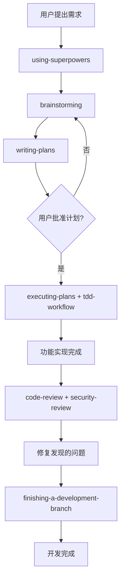

# AIPM 开发流程 & Skill 使用指南

本文档记录了 AIPM (AI Coding Stack Manager) 项目的开发流程，以及各 superpowers skill 在流程中的位置和作用。

---

## 完整开发流程

### 阶段 1：启动 & 规则确立

**Skill**: `superpowers:using-superpowers`

**位置**: 对话最开始

**作用**:
- 建立"必须先检查技能、再执行操作"的规则
- 确保后续开发遵循项目既定的工作流
- 是所有 superpowers 驱动开发的入口

---

### 阶段 2：需求分析 & 方案讨论

**Skill**: `superpowers:brainstorming`

**位置**: 需求确定后，写代码前

**作用**:
- 发散思考项目定位、核心抽象、设计原则
- 确认项目核心定位：**aipm = AI Coding 环境的控制平面**
- 输出完整的方案设计，写入 `README.md`
- 帮助在写代码前对齐整体架构思路

---

### 阶段 3：实现计划编写

**Skill**: `superpowers:writing-plans`

**位置**: `brainstorming` 完成后，编码前

**作用**:
- 将发散思路整理为**分步可执行的计划**
- 明确第一阶段开发目标，收敛开发范围
- 列出每个步骤的具体任务，请求确认后再开始编码
- 避免走偏，确保双方对开发范围达成一致

---

### 阶段 4：编码执行

**Skill**: `everything-claude-code:tdd-workflow` + `superpowers:executing-plans`

**位置**: 计划批准后，实际编码阶段

**作用**:
- **`everything-claude-code:tdd-workflow`**: 强制"先写测试，再写实现"的测试驱动开发
  - 先写测试用例
  - 再编写功能代码让测试通过
  - 保证核心逻辑正确性，便于后续重构
- **`superpowers:executing-plans`**: 按计划分步执行
  - 按计划顺序依次实现，保持清晰节奏
  - 每完成一个模块，对应一个 git 提交，保持提交粒度清晰

---

### 阶段 5：代码质量保证

**Skill**: `everything-claude-code:code-review` + `everything-claude-code:security-review`

**位置**: 功能实现完成后

**作用**:
- `code-review`: 检查代码是否符合编码规范，是否遵循项目已有的模式
- `security-review`: 检查是否存在安全问题
- 确保代码质量进入下一阶段

---

### 阶段 6：开发分支收尾

**Skill**: `superpowers:finishing-a-development-branch`

**位置**: 所有功能完成，测试通过后

**作用**:
- 整理提交历史
- 确认所有测试通过
- 准备合并或提交 Pull Request

---

## 流程图

---

## 本次开发提交对应流程

| Git 提交 | 对应流程阶段 | 使用的 Skill |
|---------|-------------|-------------|
| `d0858c2 chore: 初始化 TypeScript 项目` | 执行计划第一步 | `executing-plans` + `tdd-workflow` |
| `fedb4a6 chore: add jest configuration` | 配置测试环境 | `tdd-workflow` |
| `52b21df feat: 定义核心类型` | 按计划实现核心接口 | `executing-plans` |
| `524075d feat: 添加工具函数和缓存管理器` | 实现基础设施 | `executing-plans` |
| `b45a068 feat: 添加 stack.yaml 解析器` | 实现核心配置解析 | `tdd-workflow` + `executing-plans` |

---

## 核心设计原则

1. **声明式优先** - `stack.yaml` 是唯一真相源
2. **本地优先** - 第一阶段不做中央注册表，直接从 Git 安装
3. **80% 标准 + 20% 平台特化** - 核心抽象统一，平台差异由 Adapter 处理
4. **先思考后编码** - 对齐思路再动手，减少返工
5. **测试驱动** - 核心逻辑必须有测试覆盖

---

## 第一阶段待完成任务

- [x] 项目初始化 & Jest 配置
- [x] 定义核心 TypeScript 类型
- [x] 工具函数 & 缓存管理器
- [x] `stack.yaml` 解析器 & 验证
- [x] Git 安装器（从 Git 克隆技能/代理/MCP到缓存）
- [x] Adapter 接口实现
  - [x] `claude-code` adapter
  - [x] `openclaw` adapter
  - [x] `opencode` adapter
- [x] CLI 命令实现
  - [x] `aipm init`
  - [x] `aipm install`
  - [x] `aipm export`
  - [x] `aipm use`

**第一阶段 MVP 已完成！** 🎉
